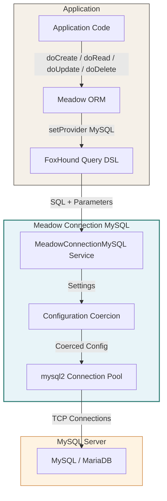
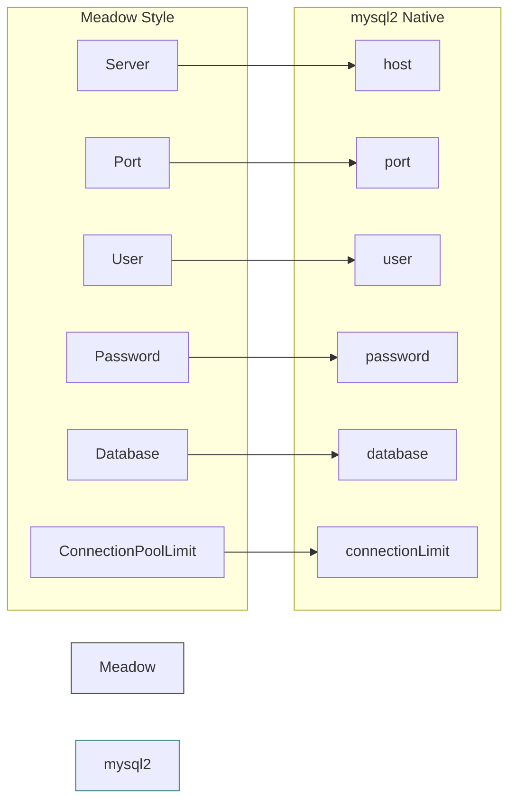
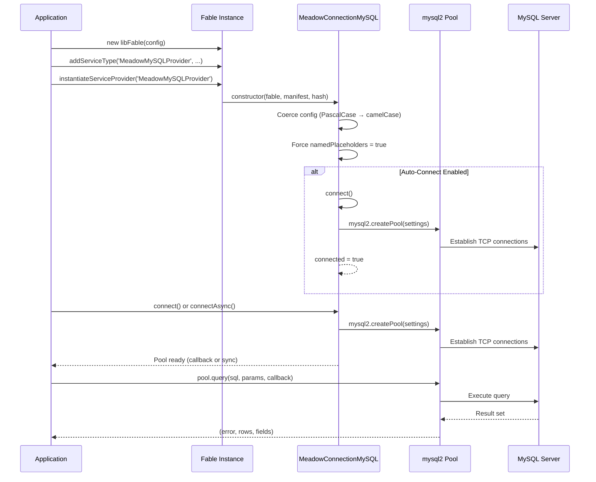
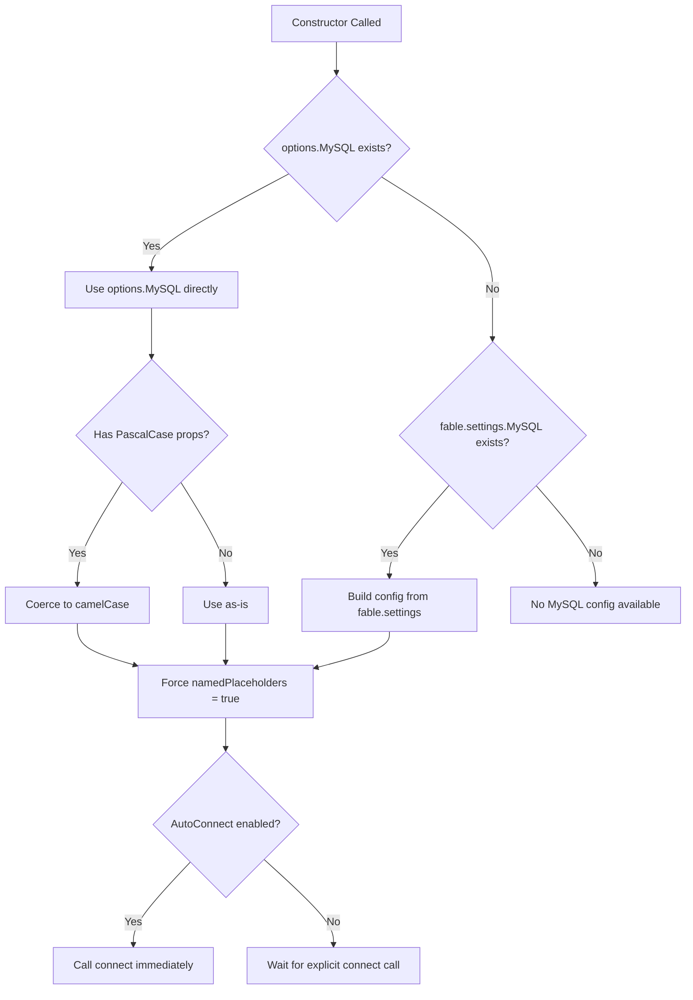
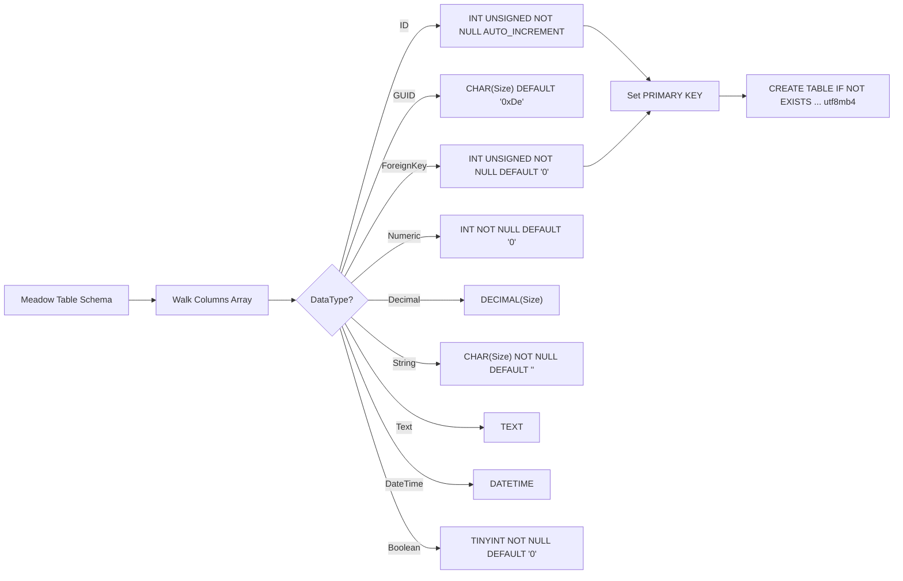
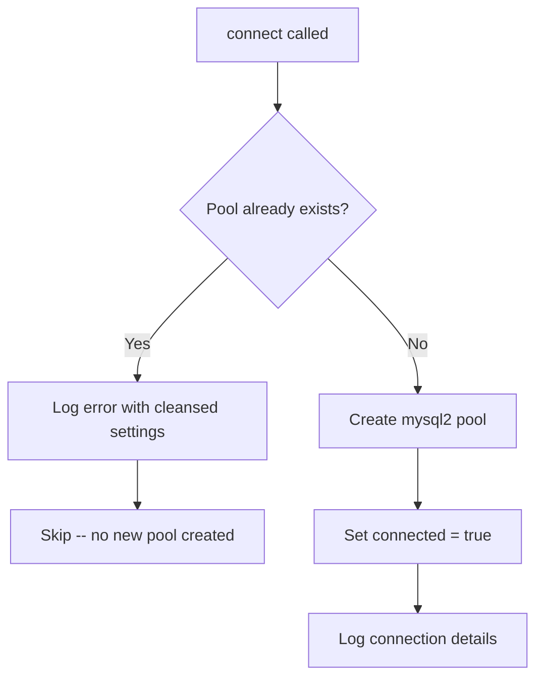
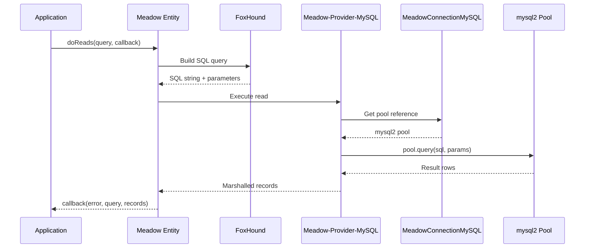

# Architecture

Meadow Connection MySQL bridges the Meadow data access layer and the MySQL database server. This page documents the component design, data flow, configuration pipeline, and how the connection pool integrates with the broader Retold ecosystem.

---

## System Architecture

---

## Component Responsibilities

### MeadowConnectionMySQL Service

The core class, extending `FableServiceProviderBase`. It manages the lifecycle of the mysql2 connection pool:

- **Construction** -- Reads MySQL settings from Fable config or per-instance options, coerces PascalCase to camelCase, forces `namedPlaceholders: true`, optionally auto-connects
- **Pool Management** -- Creates a single mysql2 pool, guards against double-connect, masks passwords in log output
- **DDL Generation** -- Produces `CREATE TABLE IF NOT EXISTS` statements from Meadow table schema objects
- **Table Execution** -- Executes DDL against the pool, handles "already exists" gracefully

### Configuration Coercion

The constructor translates between two naming conventions:

The Meadow-style format is the standard convention used across Retold modules. The camelCase format is what mysql2 expects natively. Both are accepted -- the constructor detects which format is present and coerces as needed.

### mysql2 Connection Pool

The underlying pool managed by [mysql2](https://github.com/sidorares/node-mysql2):

- Maintains a set of reusable TCP connections up to the configured `connectionLimit`
- Connections are acquired from the pool for each query and returned automatically
- Named placeholders allow parameterized queries using `:paramName` syntax
- The pool handles connection failures, timeouts, and reconnection internally

---

## Connection Lifecycle

---

## Configuration Pipeline

Settings flow through a priority chain:

1. **Per-instance options** -- Passed as the second argument to `instantiateServiceProvider()`. If the options include a `MySQL` object, it is used directly.
2. **Fable settings** -- If no per-instance `MySQL` object is present, the constructor reads `fable.settings.MySQL` and builds the config from PascalCase properties.
3. **Auto-connect flag** -- Checked in both per-instance options and Fable settings. If `MeadowConnectionMySQLAutoConnect` is true in either location, `connect()` is called during construction.

---

## DDL Generation Flow

The `generateCreateTableStatement()` method walks a Meadow table schema and produces MySQL DDL:

The `ID` and `ForeignKey` types designate the column as the primary key. The table is always created with `DEFAULT CHARSET=utf8mb4 COLLATE=utf8mb4_unicode_ci`.

---

## Pool Safety

The service includes guards against common connection issues:

### Double-Connect Prevention

If `connect()` is called when a pool already exists, the method logs an error with the connection settings (password masked as `*****************`) and returns without creating a second pool. This prevents connection leaks from accidental double-initialization.

### ConnectAsync Error Handling

The `connectAsync()` method wraps `connect()` in a try-catch:

- If the callback is missing, logs a warning and substitutes a no-op function
- If `connect()` throws, the error is caught and passed to the callback
- If already connected, returns the existing pool without reconnecting

---

## Meadow Integration

When a Meadow entity sets its provider to `'MySQL'`, queries follow this path:

The connection pool is shared across all Meadow entities in the application. Each entity resolves the pool through the Fable service registry, so there is a single pool regardless of how many entity types are in use.

---

## Comparison with Other Connectors

| Feature | MySQL | MSSQL | SQLite | RocksDB |
|---------|-------|-------|--------|---------|
| Connection Type | Pool (TCP) | Pool (TDS) | File handle | File handle |
| Server Required | Yes | Yes | No | No |
| Named Placeholders | Yes | Yes | Yes | N/A |
| Auto-Connect | Yes | No | No | No |
| DDL Generation | Yes | Yes | No | No |
| Config Coercion | PascalCase → camelCase | N/A | N/A | N/A |
| Connection Guard | Double-connect prevention | N/A | N/A | N/A |
| Underlying Library | mysql2 | tedious | better-sqlite3 | rocksdb |
